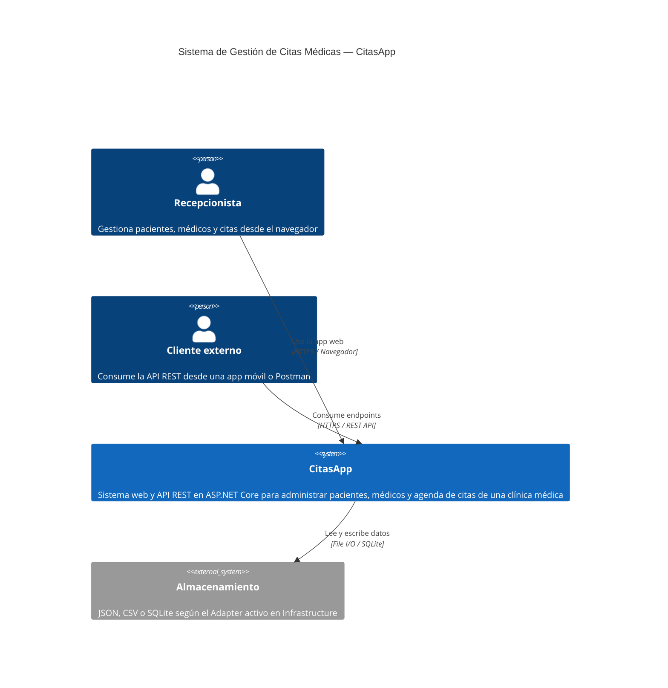

# Diagramas - CitasApp

## C4 Nivel 1 — Contexto del Sistema

```mermaid
C4Context
    title Sistema de Gestión de Citas Médicas — CitasApp

    Person(recepcionista, "Recepcionista", "Gestiona pacientes, médicos y citas desde el navegador")
    Person(cliente, "Cliente externo", "Consume la API REST desde una app móvil o Postman")

    System(citasapp, "CitasApp", "Sistema web y API REST en ASP.NET Core para administrar pacientes, médicos y agenda de citas de una clínica médica")

    System_Ext(almacenamiento, "Almacenamiento", "JSON, CSV o SQLite según el Adapter activo en Infrastructure")

    Rel(recepcionista, citasapp, "Usa la app web", "HTTPS / Navegador")
    Rel(cliente, citasapp, "Consume endpoints", "HTTPS / REST API")
    Rel(citasapp, almacenamiento, "Lee y escribe datos", "File I/O / SQLite")
```

### Uso de IA
YO Heidi Peña Betanzos  no use AI.